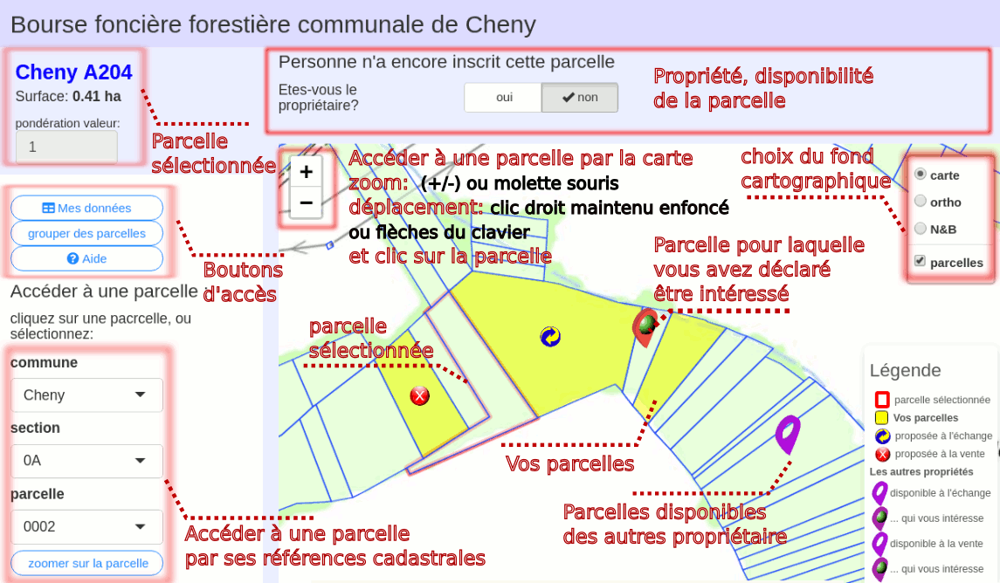
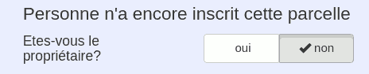
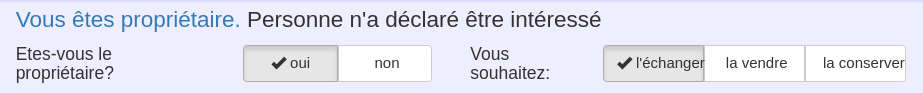
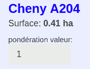
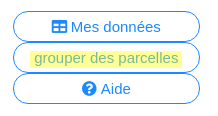
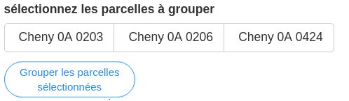
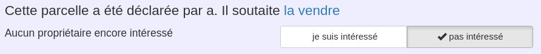

```{r setup, include=FALSE, echo=FALSE}
knitr::opts_chunk$set(echo = TRUE)
library(dplyr)
library(sf)
library(ggplot2)
select <- dplyr::select
```

<style>
body{background-color:#eeeeff}
h1{border-bottom: solid;font-size:26px;
    border-bottom-width: thin;}
h2{font-size:22px;font-weight:800}
</style>

# Pourquoi une bourse ?  

Le morcellement des parcelles forestière induit de nombreuses contraintes pour le propriétaire: difficulté à retrouver et délimiter ses parcelles, commercialisation de très petits lots de bois très mal payés, accès et stockage des bois mal organisés, importance des lisières nuisant à la croissance des arbres et susceptible de multiplier les conflits entre riverain...   

Les bourses foncières ont pour objectif de mettre en relation les propriétaires de petites parcelles en vue de regrouper leurs parcelles par le biais d'échanges et d'acquisition. Le fait de mutualiser l'information des parcelles disponibles des uns et des autres est de povoir envisager des échanches multipartites, offrant bien plus de possibilités que les échanges habituels deux à deux.  

*Dans l'exemple suivant, les propriétaires A, B et C possèdent la même surface avant et après échange. Pourtant, A cède 7 ares à C duquel il ne reçoit rien. Un échange en vis-a-vis n'aurait pas pu être réalisé.*

```{r fig.align='center',fig.height=8, echo=FALSE, warning=FALSE}
p = readRDS("./data/rdata/parcelles.rds") %>% 
  mutate(num=as.numeric(as.character(numero)))%>% filter(nom_com == "Cheny" & section == "0A") %>% arrange(num) %>% slice(120:130+9)
p$num <- 1:11
p$propriétaire <- toupper(c("a","a","b","a","c","b","a","b","a","b","c"))
tab <- p %>% as.data.frame() %>% select(etiquette,surface,propriétaire)
p$date <- "1.avant"

p2 <- p
p2$date <- "2.après"
p2$propriétaire <- toupper(c("a","a","a","a","c","c","c","b","b","b","b"))

p <- rbind(p,p2)
ggplot(p) +
   geom_sf(aes(fill = propriétaire)) +
   geom_sf_text(aes(label = c(num)))+
  theme(axis.text = element_blank(),axis.title = element_blank(),axis.ticks = element_blank(),panel.background = element_blank())+
  facet_wrap(vars(date),nrow = 1,ncol = 2)


# e <- p %>% as.data.frame() %>%  group_by(propriétaire,date)%>% summarise(cède=sum(surface)) 
# %>% filter(propriétaire!=échange)
# colnames(e) <- c("le propriétaire...","cède à ...","hectares")
# knitr::kable(e)
```

# Principe  

- Les propriétaires s'inscrivent sur le site internet https://sdumas.shinyapps.io/echange/  
- Ils indiquent les parcelles qu'ils mettent à disposition des autres propriétaire, soit pour des échanges, soit pour les vendre  

- Ils indiquent quelles parcelles les intéressent parmi les parcelles mises à disposition par les autres propriétaires  

- Des tableaux récapitulatifs les aident à définir le meilleur accord afin d'obtenir des échanges équilibrés  

# Inscription  

L'inscription est réservée aux personnes possédant déjà au moins une parcelle forestière sur la commune de Cheny.  

En s'inscrivant, le propriétaire accepte d'échanger ses données (adress mail, localisation des parcelles mises à disposition) aux autres propriétaire.  

# Aperçu de l'interface  


 
# Accès aux parcelles  

L'accès aux parcelles se fait de 2 manières:  

- soit en renseignant les références cadastrales de la parcelle dans les menus déroulants situés à gauche de la fenêtre  

- soit en navigant dans la carte avec la souris (molette ou bouttons +/- pour zoomer/dézoomer, clic gauche maintenu enfoncé pour déplacer la carte) puis en cliquant sur la parcelle voulue.  

Le nom de la parcelle sélectionnée apparaît en bleu en haut à gaiche de l'écran.  

# Gérer ses parcelles  

## Mettre une parcelle à disposition  


Si la parcelle n'a pas encore été revendiquée, la question suivante apparaît:  

{width=300px}   

Cliquez sur oui si cette parcelle vous appartient et si vous souhaitez la rendre visible aux autres propriétaires.  

La parcelle apparaît maintenant avec un fond jaune (vos propriétés).  

Vous pouvez maintenant choisir de la destination à donner à votre parcelles: l'échanger (le logo {width=30px} apparaîtra sur la parcelle), la vendre (logo {width=30px}), ou la garder (absence de logo).  

 

Dans les deux premiers cas, une icône apparaîtra sur la carte des autres usagers pour leur signaler qu'il peuvent déclarer leur intérêt à son acquisition.  

Pour l'heure, personne ne s'est encore déclaré intéressé. Quan ce seera le cas, son nom apparaîtra.  

## Définir la valeur de sa parcelle  


Lorsque vous êtes propriétaire, vous avez accès à la case "pondération valeur":  

{width=100px}   

La surface de la parcelle est multipliée par ce coefficient pour obtenir un indice de valeur. Pour vos parcelles proposées en échange merci d`estimer ce coefficient de la manière suivante:  

- Terrain à peuplier des vallées de l Yonne et de l Armançon ou des sources: **1**  
- Terrains sableux, secs, anciennes sablières, ou marégageux: **0.5**  
- Autres terrains non alimentés par une nappe d`eau: **0.75**  

Le boisement situé dans la parcelle ne rentre pas en compte dans le calcul de cet indice. Il est suspetible cependant d entraîner une compensation financière (à voir au cours de la négociation finale).  

## Proposer un lot de parcelles en les groupant  

Si vous ne voulez pas échanger ou vendre une parcelle sans ses voisines, vous pouvez créer un groupe de parcelles:  

{width=150px}   

Cliquez sur les étiquettes des parcelles à grouper ensemble, puis *Grouper les parcelles sélectionnées*.  

Pour supprimer le goupe, cliquez sur l'étiquette du groupe, puis *Dissocier les parcelles du groupe sélectionnées*

{width=200px}   

# Les parcelles des autres propriétaires  

## Localiser les parcelles disponibles  

Les parcelles mises à disposition par les autres propriétaires apparaissent avec les logos {width=30px} (parcelles à échanger) ou {width=30px} (parcelle en vente).  

## Se déclarer intéressé par une parcelle  

Lorsque vous cliquez sur une parcelle disponible, la question suivante apparaît :    

{width=400px}   
  
Si vous répondez **je suis intéressé**, votre nom est mis à disposition du propriétaire concerné. La parcelle s'affiche maintenant avec le logo: {width=30px}.  


